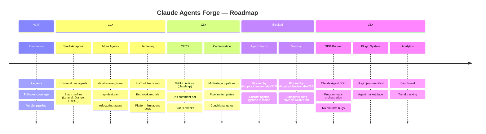
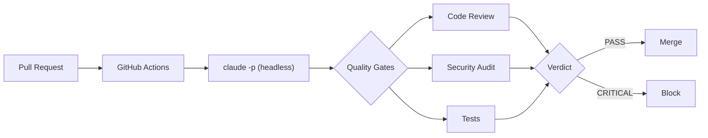
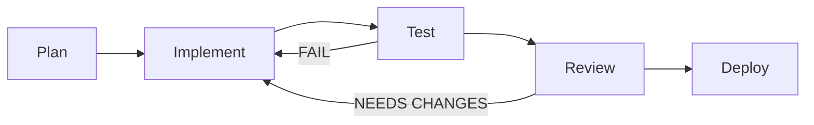
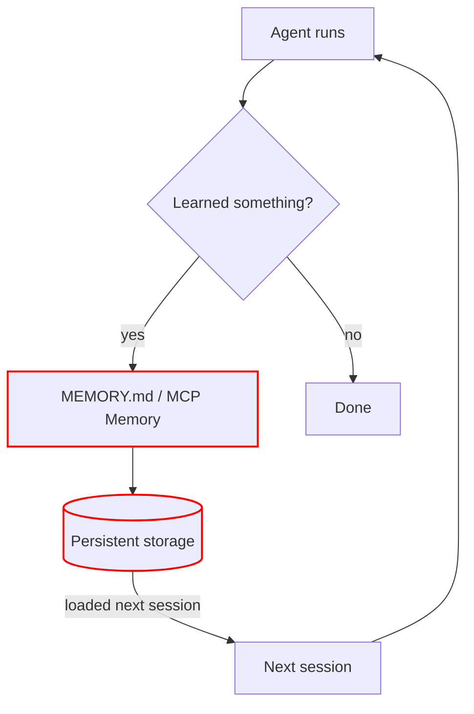
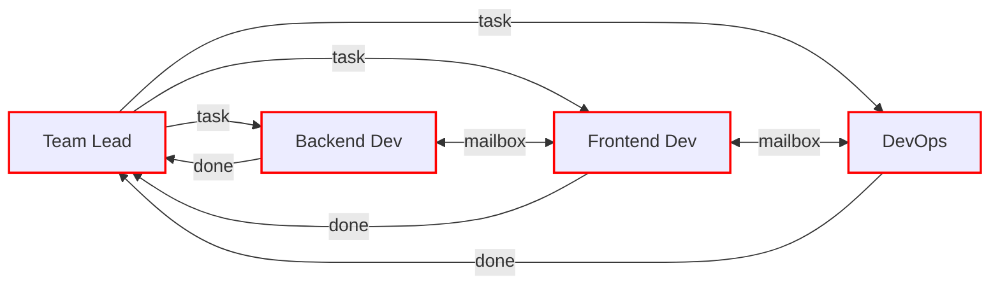
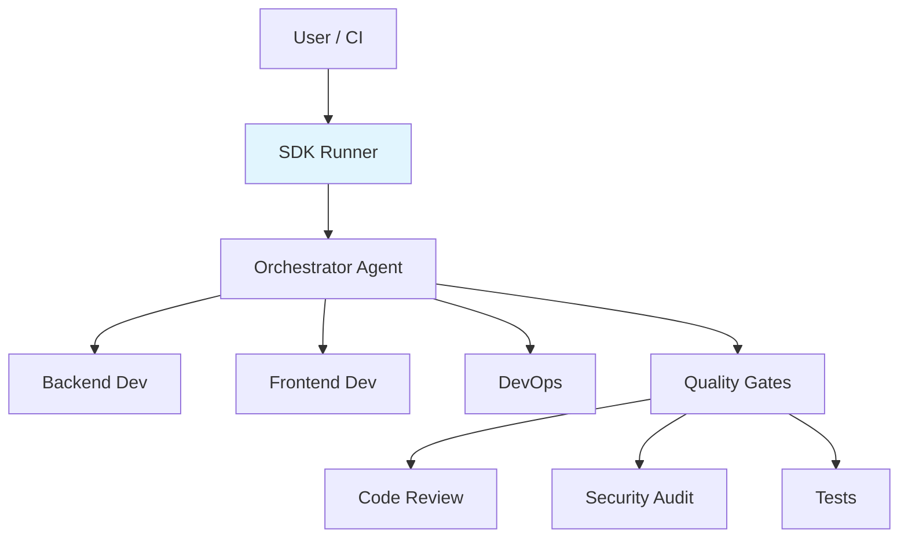

# Roadmap

> **Contributions welcome** — pick any item, [open an issue](https://github.com/Mationetap/claude-agents-forge/issues), submit a PR.

 

 

## Platform Bugs & Blockers

> These Claude Code platform bugs directly affect our architecture and roadmap. Track them — when fixed, blocked roadmap items become unblocked.

| # | Bug | Severity | Affects | Issue |
|---|-----|----------|---------|-------|
| 1 | MCP tools inaccessible from `--agent` main thread | **CRITICAL** | Conductor can't use MCP directly | [#13898](https://github.com/anthropics/claude-code/issues/13898) |
| 2 | Subagents don't save MEMORY.md | **HIGH** | All agent memory/learning | [#25318](https://github.com/anthropics/claude-code/issues/25318) |
| 3 | `disallowedTools` doesn't block MCP tools | **HIGH** | Quality agent read-only guarantee | [#12863](https://github.com/anthropics/claude-code/issues/12863) |
| 4 | Custom agents silently ignored in Agent Teams | **HIGH** | Agent Teams roadmap | [#30703](https://github.com/anthropics/claude-code/issues/30703) |
| 5 | `disallowedTools` bypassed via Bash sed/awk | **MEDIUM** | Quality agent read-only guarantee | Not filed |
| 6 | Edit tool breaks hard links (Windows) | **MEDIUM** | Agent deployment via hardlinks | Not filed |
| 7 | Bash corrupts UTF-8 inline args (Windows) | **MEDIUM** | i18n API calls | [#7332](https://github.com/anthropics/claude-code/issues/7332) |
| 8 | `allowedTools` unreliable with `bypassPermissions` | **MEDIUM** | Tool restriction enforcement | [#12232](https://github.com/anthropics/claude-code/issues/12232) |
| 9 | Skills frontmatter not loaded for team agents | **MEDIUM** | Agent Teams + skills | [#29441](https://github.com/anthropics/claude-code/issues/29441) |

**Workaround strategy:** Only depend on features that reliably work: markdown prompts, `Task()` delegation, `disallowedTools` for built-in tools, `maxTurns`, `PreToolUse` hooks. Avoid depending on: MCP in main thread, subagent memory, `disallowedTools` for MCP tools, Agent Teams with custom agents.

 

## v1.0 — Foundation 

> 9 production-hardened agents with full spec coverage

- [x] Conductor orchestrator (opus, 200 turns)
- [x] 5 quality agents — read-only enforcement via `disallowedTools`
- [x] 3 dev agents — backend, frontend, devops
- [x] Turn budgets + Bash timeout tables
- [x] Verdict-driven pipeline (PASS → CRITICAL)
- [x] Memory scopes — user / project / local
- [x] MCP first, Bash fallback pattern

 

## v1.1 — Stack-Adaptive Dev Agents 

> Universal dev agents with embedded stack profiles — one agent works with any framework

**Problem:** Current `backend-dev` is hardcoded to Laravel/PHP, `frontend-dev` mixes Next.js/Nuxt/React/Vue patterns. Users must fork and rewrite for their stack.

**Solution:** Refactor dev agents with stack profiles inside the prompt. Agent detects stack in 1-2 turns and follows the relevant profile. Quality stays high because profiles contain framework-specific patterns (not generic advice).

**Why not separate agents per stack:** Creates 6+ near-identical files with ~70% duplicated content. Harder to maintain. Pollutes conductor's `Task()` list. Breaks memory (knowledge split across agents). See [Architecture Decision Record](docs/adr-001-stack-profiles.md).

**Why not `skills:` field:** Skills frontmatter has bugs (#29441, #17283, #25380) and doesn't work in Agent Teams (#30703). Stack profiles inside the prompt work everywhere — subagents, teams, plugins, SDK.

- [ ] Refactor `backend-dev.md` — extract Laravel-specific content into `## Stack: Laravel` section, add generic workflow
- [ ] Add stack profiles: Django, Rails, Express/NestJS, Go
- [ ] Refactor `frontend-dev.md` — already multi-framework, clean up into profile sections
- [ ] Refactor `devops-engineer.md` — extract Docker base image specifics into profiles
- [ ] Create `stack-profiles/` reference directory with standalone profile docs for copy-paste customization
- [ ] Update conductor delegation to pass detected stack info to dev agents
- [ ] Update CONTRIBUTING.md with stack profile guidelines

 

## v1.2 — More Agents 

> Expand coverage without bloat — every agent earns its place

| Agent | Type | Purpose |
|-------|------|---------|
| `database-engineer` | quality | Schema design review, query optimization, index analysis, migration safety |
| `refactoring-agent` | development | Code smell detection, extract method/class, dead code removal, pattern alignment |
| `api-designer` | quality | OpenAPI spec review, REST/GraphQL best practices, versioning, contract consistency |

Deferred to later (niche use cases):

| Agent | Reason to defer |
|-------|----------------|
| `dependency-auditor` | Overlap with existing tools (Dependabot, npm audit, Snyk) |
| `i18n-reviewer` | Only relevant for internationalized projects |
| `accessibility-auditor` | Only relevant for frontend-heavy web projects |

 

## v1.3 — Hardening & Workarounds 

> Make the system robust despite platform bugs

- [ ] **`PreToolUse` hooks** — reliable alternative to `disallowedTools` for enforcing read-only quality agents (blocks Bash file modification attempts at runtime, not just via prompt)
- [ ] **Memory fallback** — adjust all agent prompts: if MEMORY.md doesn't exist, re-detect stack (don't assume memory works). Remove "MANDATORY" language that implies memory always saves.
- [ ] **MCP safety review** — audit which MCP servers are given to quality agents (since `disallowedTools` doesn't block MCP tools). Remove MCP servers with write operations from read-only agents.
- [ ] **Platform bugs documentation** — publish known bugs, workarounds, and tested Claude Code versions
- [ ] **Agent deployment guide** — document symlink vs hardlink vs copy tradeoffs (hardlinks break on Edit, symlinks need admin on Windows)
- [ ] **Conductor resilience** — handle gracefully when subagent fails, times out, or returns malformed report

 

## v2.0 — CI/CD Integration 

> Quality gates in your pipeline — uses `claude -p` headless mode, no platform bugs

Moved up from v3.1 because `claude -p` (headless mode) works reliably today and doesn't depend on any buggy features.

- [ ] **GitHub Actions workflow** — run individual quality agents via `claude -p --agent code-reviewer`
- [ ] **PR comment bot** — parse agent verdict JSON, post as PR review comment
- [ ] **Status checks** — block merge on CRITICAL verdicts
- [ ] **Diff-only mode** — pass `git diff` to agents, review only changed lines
- [ ] **GitLab CI template** — equivalent workflow
- [ ] **Pre-commit hook** — local quality check before push

 

## v2.1 — Advanced Orchestration 

> Smarter pipelines, fewer wasted turns

These features work within the current `Task()` delegation model (no blocked bugs):

- [ ] **Multi-stage pipelines** — plan → implement → test → review → deploy
- [ ] **Pipeline templates** — presets for bug fix, feature, refactor (different quality gate combinations)
- [ ] **Conditional gates** — skip security audit for CSS-only changes (already partially in conductor, formalize it)
- [ ] **Retry policies** — configurable correction round-trip count (currently hardcoded to 3)
- [ ] **Scope estimation** — conductor estimates task size before delegating, warns user if too large for one run

Deferred (depends on blocked features or SDK):

| Item | Blocker |
|------|---------|
| Parallel dev agents with file locking | Needs Agent Teams (#30703) or SDK |
| Cost tracking (token usage per pipeline) | No API for token counting in Claude Code |

 

## v2.2 — Memory & Learning 

> Blocked by [#25318](https://github.com/anthropics/claude-code/issues/25318) — subagents don't save MEMORY.md

**Current state:** `memory` field in frontmatter is declared but subagents don't actually save MEMORY.md. All "Memory Strategy" sections in agents are effectively dead code.

**When unblocked:**
- [ ] **Verify memory works** — test MEMORY.md creation/update by subagents on latest Claude Code version
- [ ] **Project fingerprinting** — first-run scan populates stack, conventions, config
- [ ] **Cross-session learning** — remember patterns, past findings, recurring issues
- [ ] **MCP Memory Service** — structured long-term memory with semantic search
- [ ] **Auto-calibration** — adjust review depth based on past false positive rate
- [ ] **Memory hygiene** — auto-cleanup of stale/conflicting memories
- [ ] **Onboarding memory** — first-run scan populates project structure & deps

 

## v2.3 — Agent Teams 

> Blocked by [#30703](https://github.com/anthropics/claude-code/issues/30703) — custom agent definitions silently ignored in teams

**Current state:** Agent Teams is experimental. Custom agents from `~/.claude/agents/` are silently ignored — all frontmatter and prompts are dropped. No workaround exists.

**Additional blockers:**
- Skills not loaded for team agents (#29441)
- No Windows Terminal split pane support
- No session resumption
- No nested teams

**When unblocked:**
- [ ] Team Lead agent coordinating parallel dev agents
- [ ] Shared task list between teammates
- [ ] Direct mailbox communication between agents
- [ ] Conflict resolution for overlapping file changes
- [ ] File locking protocol for parallel dev work

 

## v3.0 — SDK Runner 

> Alternative product: programmatic agent orchestration via Claude Agent SDK — no platform bugs

**What:** A TypeScript/Python application using the official [Claude Agent SDK](https://github.com/anthropics/claude-agent-sdk-typescript) (`@anthropic-ai/claude-agent-sdk`) to run the same agent workflows programmatically. Same agents, different runtime — no Claude Code platform bugs.

**Why:** Claude Agent SDK is Anthropic's official library that exposes Claude Code's internals (Read, Write, Edit, Bash, Glob, Grep, subagents, hooks) as a programmable API. It bypasses all platform bugs because you control the execution loop.

**Trade-offs:**

| | Claude Code (current) | SDK Runner (future) |
|---|---|---|
| Setup | Copy .md files | Install package, configure |
| Audience | Claude Code users | Developers, CI/CD |
| Platform bugs | All of them | None (you own the runtime) |
| Sandboxing | OS-level (built-in) | You must implement |
| UI | Interactive terminal | Headless / custom |
| Maintenance | Zero | You maintain the runner |
| Cost model | Claude subscription | Per-token API billing |

- [ ] Prototype: single-agent runner (one quality agent via SDK)
- [ ] Multi-agent orchestration (conductor pattern via SDK subagents)
- [ ] Port agent prompts from .md to SDK agent configs
- [ ] Hook-based tool restrictions (reliable, no disallowedTools bugs)
- [ ] CI/CD integration (GitHub Actions with SDK runner)
- [ ] Cost tracking (SDK gives token usage per call)
- [ ] Web dashboard for monitoring runs

 

## v3.1 — Plugin System 

> One-command install, community marketplace

- [ ] Package as Claude Code plugin (`plugin.json` manifest)
- [ ] One-command installation via plugin registry
- [ ] Settings UI for selecting which agents to enable
- [ ] Agent marketplace — community agents with ratings
- [ ] Plugin hooks for custom pre/post agent actions

 

## v3.2 — Reporting & Analytics 

> See how your code quality evolves

- [ ] HTML report — visual quality report with charts
- [ ] Trend tracking — quality score over time
- [ ] Verdict history — track recurring issues
- [ ] Agent performance metrics — turns, time, accuracy
- [ ] Dashboard — web UI for monitoring runs

 

## Ongoing

> Continuous improvements across all versions

- [ ] Turn budget optimization (measure actual usage per phase)
- [ ] More MCP servers — Prettier, Biome, Ruff, mypy, Clippy
- [ ] Windows-native improvements (PowerShell compatibility, UTF-8 workarounds)
- [ ] Agent prompt compression (reduce tokens without losing quality)
- [ ] Benchmark suite — reproducible test cases for agent quality
- [ ] Multilingual docs — Russian, Chinese, Japanese, Spanish
- [ ] Track and test against new Claude Code releases (bug fixes may unblock roadmap items)

 

---

  <b>Want to contribute?</b> 
  Pick any item, <a href="https://github.com/Mationetap/claude-agents-forge/issues">open an issue</a>, submit a PR. 
  See <a href="CONTRIBUTING.md">CONTRIBUTING.md</a> for quality standards.

